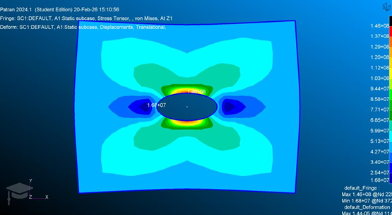
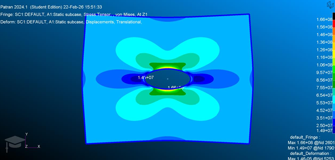
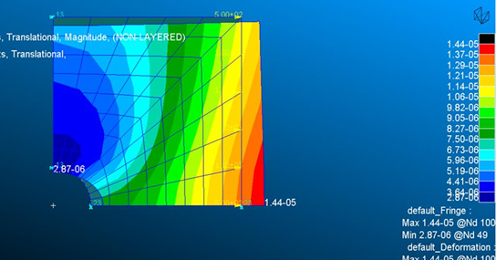
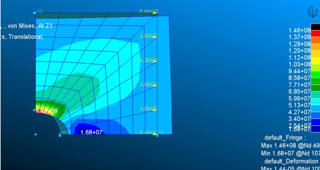

# TP2 — Finite Element Modeling with Nastran: Linear Analysis of a Perforated Thin Plate

Finite element analysis of stress concentration around a circular hole in a thin plate under tensile loading, including a mesh convergence study and a symmetry-based model reduction.

## Case study

Square steel plate, L = 10 cm side, 2 mm thick, with a central circular hole (R = 1 cm), subjected to a uniformly distributed tensile load of 10,000 N per side. Same steel properties as TP1.

## Study 1 — Baseline model (8-element mesh)

- Geometry split into 8 symmetric surfaces around the hole, quadrilateral shell mesh (5 elements/edge, 8 elements/diagonal), node equivalencing to merge duplicate nodes at surface boundaries.
- Symmetry boundary conditions applied at x = L/2 and y = L/2.

| Quantity | Value |
|---|---|
| Max displacement | 1.44×10⁻⁵ m |
| Max Von Mises stress | 146 MPa (at the hole boundary) |
| Analytical (Peterson, Ktg = 3.14) | 157 MPa |
| Deviation | ~7% |

The deviation is attributed to insufficient mesh density near the hole, where stress gradients are highest.

*Von Mises stress concentration around the hole — 8-element mesh, max 146 MPa*

## Study 2 — Mesh convergence

Three progressively refined meshes were compared (same geometry, symmetric subdivision):

| Mesh | Max displacement | Max Von Mises stress |
|---|---|---|
| 12 elements | 1.45×10⁻⁵ m | 156 MPa |
| 20 elements | 1.46×10⁻⁵ m | 162 MPa |
| 50 elements | 1.46×10⁻⁵ m | 166 MPa |
| Analytical (Peterson) | — | 157 MPa |

**Displacement converges almost immediately** (global stiffness is well captured even with a coarse mesh), while the **local stress concentration keeps increasing with refinement** — a classic FEM behavior: coarse meshes average stress over large elements and underestimate concentration peaks near geometric discontinuities.

*Von Mises stress concentration around the hole — finest mesh (50 elements), max 166 MPa, closest to the analytical prediction*

## Study 3 — Quarter-plate symmetry reduction

Since geometry, hole, and loading are all symmetric about both axes, only one quarter of the plate was modeled (8-element mesh matching Study 1's density), reducing the DOF count by ~4×.

*Quarter-plate model with symmetry boundary conditions applied on the cut edges*

- Max Von Mises stress: **146 MPa** — practically identical to the full-plate model with the same mesh density.
- Confirms that symmetry reduction preserves accuracy while cutting computational cost, an efficient and reliable technique whenever geometry and loading symmetry allow it.

*Von Mises stress on the quarter-plate model — matches the full-plate baseline result (146 MPa) at a fraction of the computational cost*

## Computational time vs mesh density

| Mesh | Real time (s) |
|---|---|
| 8 elements | 0.712 |
| 12 elements | 0.727 |
| 20 elements | 1.191 (+67% vs 8-element) |
| 50 elements | 4.764 (~6.7× vs 8-element) |

Computational cost grows much faster than linearly with mesh density (stiffness matrix assembly, factorization, and linear system solve all scale unfavorably). This is why **local mesh refinement near critical zones** (e.g. the hole) is preferred over globally refining the entire structure.

## Key takeaways

- Global quantities (displacement) converge faster than local ones (stress concentration) under mesh refinement.
- Stress concentration factors from classical charts (Peterson) provide a useful sanity check for FE results.
- Exploiting geometric/loading symmetry is an effective way to cut computational cost without losing accuracy.

## Tools

`MSC Patran` (modeling, meshing) · `MSC Nastran` (linear static solver)
