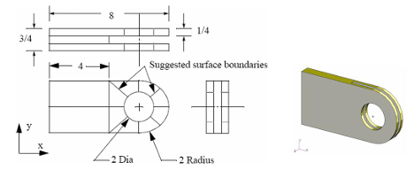
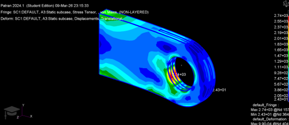
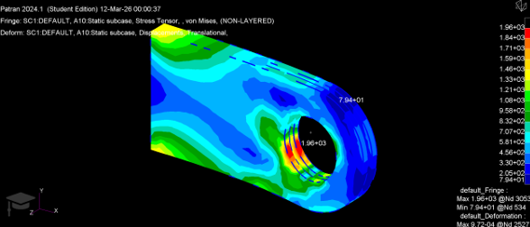
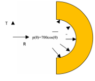
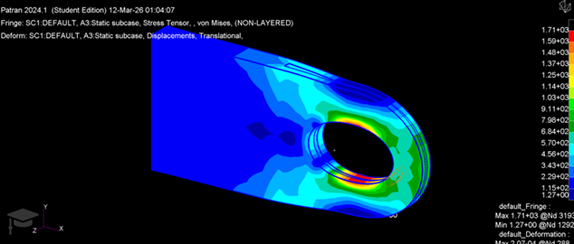

# TP3 — Finite Element Modeling with Nastran: Mesh & Element Type Comparison on a Mechanical Clevis

Comparative study of 3D element types (HEX8, HEX20, TET4, TET10) on a mechanical clevis under two loading cases, using Patran/Nastran, to determine which mesh formulation gives the most reliable results for a given computational cost.

## Component & objective

A mechanical clevis (steel, σ₀.₂ = 235 MPa) — a pin-and-fork joint used for articulated connections in automotive, mechanical, construction and aerospace assemblies. The study evaluates how mesh type and refinement affect stress/displacement accuracy under **bending** (Study 1) and a **cosine pressure distribution inside the pin hole**, p(θ) = 700·cos(θ) (Study 2), representative of the contact pressure in a pin-loaded hole.

*The mechanical clevis modeled in this study*

Four element types were compared:
- **HEX8** — linear hexahedral, 8 nodes (computationally efficient, linear interpolation)
- **HEX20** — quadratic hexahedral, 20 nodes (used as reference — most accurate)
- **TET4** — linear tetrahedral, 4 nodes (easy auto-mesh, but artificially stiff)
- **TET10** — quadratic tetrahedral, 10 nodes (good accuracy/flexibility compromise)

Since no analytical solution exists for this geometry, the **HEX20 mesh serves as the reference solution** (second-order hexahedral elements are established as highly accurate for structural problems), and all other meshes are evaluated by relative error against it.

## Study 1 — Bending, mesh convergence

Four mesh densities were tested (a = 0.5, edge-length-matched, down to a = 0.1703 cm — the finest achievable within the software's student license element limit) for all four element types.

Converged (finest mesh) results and relative error vs. HEX20 reference:

| Element | σ_VM max | Error vs HEX20 | u_max | Error vs HEX20 |
|---|---|---|---|---|
| HEX20 (reference) | 27.9 MPa | — | 9.90×10⁻⁴ m | — |
| HEX8 | 26.5 MPa | 2.56% | 9.91×10⁻⁴ m | 0.10% |
| TET10 | 26.3 MPa | 3.66% | 9.85×10⁻⁴ m | 0.81% |
| TET4 | 25.4 MPa | 6.96% | 9.72×10⁻⁴ m | 1.72% |

**Structural check:** σ_VM,max / σ₀.₂ = 27.9 MPa / 235 MPa ≈ **12%** — the clevis operates well within the elastic domain, with a large safety margin.

*Von Mises stress distribution, HEX20 mesh (reference) — bending case, max 27.4 MPa concentrated at the hole*

*Von Mises stress distribution, TET4 mesh — the least accurate element, visibly under-predicting the stress concentration around the hole*

## Study 2 — Cosine pressure loading, p(θ) = 700·cos(θ)

Same comparison approach, applied to a physically different loading case (radial pressure inside the hole, peaking at θ = 0, representative of pin-bearing contact). Two comparison protocols were used:

*Theoretical definition of the cosine pressure distribution p(θ) = 700·cos(θ) applied inside the pin hole, peaking at θ = 0*

**(a) Fixed global edge length (a = 0.5 cm)** — same spatial discretization parameter, different resulting node counts (846–5081 nodes depending on element shape):

| Element | Nodes | u_max | σ_VM max |
|---|---|---|---|
| HEX8 | 948 | 2.01×10⁻⁴ m | 1.60×10³ Pa |
| HEX20 (ref.) | 3235 | 2.07×10⁻⁴ m | 1.71×10³ Pa |
| TET4 | 846 | 1.82×10⁻⁴ m | 1.51×10³ Pa |
| TET10 | 5081 | 2.12×10⁻⁴ m | 1.75×10³ Pa |

**(b) Node-matched (~3235 nodes for every element type)** — isolates the effect of element *formulation* alone from node count:

| Element | Nodes | σ_max | u_max | Error σ | Error u |
|---|---|---|---|---|---|
| HEX20 (reference) | 3235 | 17.1 MPa | 2.07×10⁻³ mm | — | — |
| TET10 | 3232 | 17.2 MPa | 2.03×10⁻³ mm | 0.6% | 1.9% |
| HEX8 | 3208 | 16.8 MPa | 2.06×10⁻³ mm | 1.17% | 0.5% |
| TET4 | 3239 | 15.9 MPa | 1.99×10⁻³ mm | 6% | 3.9% |

**Ranking by accuracy: HEX20 > TET10 > HEX8 > TET4** — directly tracking the number of nodes per element (20 > 10 > 8 > 4), since more nodes per element means a richer (quadratic vs. linear) interpolation of the displacement field.

Structural check: σ_max = 17 MPa << σ₀.₂ = 235 MPa — large safety margin confirmed under this loading case too.

*Von Mises stress distribution under the cosine pressure loading, HEX20 reference mesh (3235 nodes) — max 1.71×10³ Pa*

## Key takeaways

- **Element order matters more than raw node count for a given edge length**: at equal node count, quadratic elements (HEX20, TET10) still clearly outperform linear ones (HEX8, TET4) — linear tetrahedra (TET4) are the least accurate in every comparison, due to their constant-strain-per-element formulation which artificially stiffens the structure and underestimates both displacement and peak stress.
- **HEX20 is the best accuracy/cost compromise** here: it converges to stable results with far fewer elements than TET meshes at similar accuracy.
- **TET10 is the best choice when automatic meshing of complex geometry is required** (as tetrahedra mesh arbitrary shapes more easily than hexahedra) and quadratic accuracy is still needed.
- Both loading cases (bending and pin-hole pressure) show the clevis operates at ~12% and ~7% of yield strength respectively — comfortably within the elastic domain.
- A practical constraint of this study: the finest intended mesh (a = 0.125 cm) exceeded the student license's element limit, so a = 0.1703 cm was used as the practical finest mesh instead.

## Tools

`MSC Patran` (modeling, meshing — HEX8/HEX20/TET4/TET10) · `MSC Nastran` (linear static solver)
